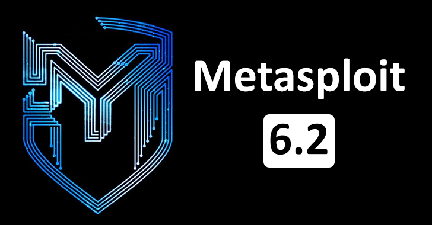

# Metasploit Framework



## Introduction

Welcome to the Metasploit Framework! Metasploit is an open-source penetration testing framework that makes it easy to develop, test, and execute exploit code against remote systems.

## Features

- **Exploitation:** Discover and exploit vulnerabilities in target systems.
- **Payloads:** Generate payloads to deliver malicious code to target systems.
- **Post-exploitation:** Perform actions on compromised systems post-exploitation.

## Installation

### Prerequisites

- Ruby (version X.X.X)
- Git
- ...

### Installation Steps

1. Clone the repository:

    ```bash
    git clone https://github.com/rapid7/metasploit-framework.git
    ```

2. Change into the Metasploit directory:

    ```bash
    cd metasploit-framework
    ```

3. Install dependencies:

    ```bash
    bundle install
    ```

4. Setup the database:

    ```bash
    ./msfdb init
    ```

5. Start the Metasploit console:

    ```bash
    ./msfconsole
    ```

## Usage

1. Launch Metasploit console:

    ```bash
    ./msfconsole
    ```

2. Select and configure an exploit module:

    ```bash
    use exploit/path/to/exploit
    set RHOSTS target_ip
    ```

3. Set payload:

    ```bash
    set payload payload/type
    ```

4. Run the exploit:

    ```bash
    exploit
    ```

## Documentation

For detailed documentation, visit the [Metasploit Documentation](https://metasploit.help.rapid7.com/docs/getting-started).

## Contributing

Contributions are welcome! Please follow the guidelines in [CONTRIBUTING.md](CONTRIBUTING.md).

## License

Metasploit Framework is released under the [BSD 3-Clause License](LICENSE).

## Support

For support, visit the [Metasploit Community](https://metasploit.help.rapid7.com/discuss).

